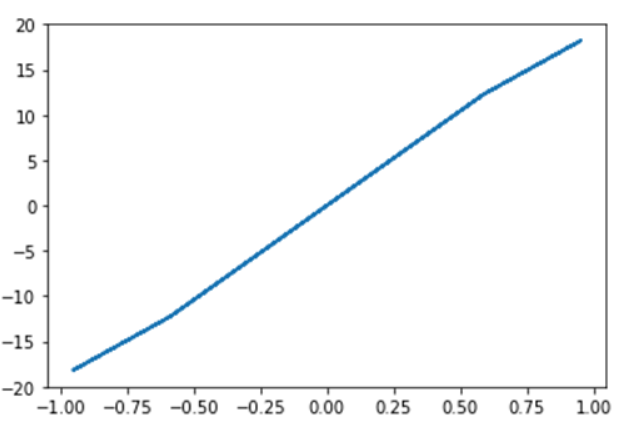

# 3. SciPy

The scipy package contains various toolboxes dedicated to common issues in scientific computing. Its different submodules correspond to different applications, such as interpolation, integration, optimization, image processing, statistics, special functions, etc.

Scipy can be compared to other standard scientific-computing libraries, such as the GSL (GNU Scientific Library for C and C++), or Matlab’s toolboxes. scipy is the core package for scientific routines in Python; it is meant to operate efficiently on numpy arrays, so that numpy and scipy work hand in hand.

**Sub-packages of SciPy:**

- File input/output - scipy.io
- Special Function - scipy.special
- Linear Algebra Operation - scipy.linalg
- Interpolation - scipy.interpolate
- Optimization and fit - scipy.optimize
- Statistics and random numbers - scipy.stats
- Numerical Integration - scipy.integrate
- Fast Fourier transforms - scipy.fftpack
- Signal Processing - scipy.signal
- Image manipulation – scipy.ndimage

#### **Import Syntax**
*They all depend on numpy, but are mostly independent of each other. The standard way of importing Numpy and these Scipy modules is:*
```py
import numpy as np
from scipy import stats
```

### **File Input / Output package:**
Scipy, I/O package, has a wide range of functions for work with different files format which are Matlab, Arff, Wave, Matrix Market, IDL, NetCDF, TXT, CSV and binary format : 
```py
import numpy as np
 from scipy import io as sio
 array = np.ones((4, 4))
 sio.savemat('example.mat', {'ar': array}) 
 data = sio.loadmat(‘example.mat', struct_as_record=True)
 data['ar']
```
Output: 
```
array([[ 1., 1., 1., 1.],
           [ 1., 1., 1., 1.],
           [ 1., 1., 1., 1.],
           [ 1., 1., 1., 1.]])
```
### **Special Function package**
- scipy.special package contains numerous functions of mathematical physics.
- SciPy special function includes Cubic Root, Exponential, Log sum Exponential, Lambert, Permutation and Combinations, Gamma, Bessel, hypergeometric, Kelvin, beta, parabolic cylinder, Relative Error Exponential, etc.

Examples : 
- ### **Cubic Root Function:**
```py
from scipy.special import cbrt
scipy.special.cbrt(x)
cb = cbrt([27, 64])
print(cb)
```
Output :
```
array([3., 4.])
```

* ### **Exponential Function:**

```py
from scipy.special import exp10
exp = exp10([1,10])
print(exp)
```
Output :
```
[1.e+01 1.e+10]
```
- ### **Permutations & Combinations:**
```py
from scipy.special import perm
per = perm(5, 2, exact = True)
print(per)
```
Output :
```
20
```
## **Linear Algebra with SciPy**

- Linear Algebra of SciPy is an implementation of BLAS and ATLAS LAPACK libraries.
- Performance of Linear Algebra is very fast compared to BLAS and LAPACK.
- Linear algebra routine accepts two-dimensional array object and output is also a two-dimensional array.

 ### **Calculating determinant of a two-dimensional matrix** ###

```py
from scipy import linalg
import numpy as np
#define square matrix
two_d_array = np.array([ [4,5], [3,2] ])
#pass values to det() function
linalg.det( two_d_array )
```
Output :
```
-7.0
```
### **Calculating Inverse Matrix of a two-dimensional matrix** ###

```py
from scipy import linalg
import numpy as np
# define square matrix
two_d_array = np.array([ [4,5], [3,2] ])
#pass value to function inv()
linalg.inv( two_d_array )
```
Output :
```
array( [[-0.28571429,  0.71428571],
       [ 0.42857143, -0.57142857]] )
```

### **Calculating Eigenvalues and Eigenvector of a two-dimensional matrix** ###

```py
from scipy import linalg
import numpy as np
#define two dimensional array
arr = np.array([[5,4],[6,3]])
#pass value into function
eg_val, eg_vect = linalg.eig(arr)
#get eigenvalues
print(eg_val)
#get eigenvectors
print(eg_vect)
```
Output :
```
[ 9.+0.j -1.+0.j] 
[ [ 0.70710678 -0.5547002 ] 
  [ 0.70710678  0.83205029] ]
```

### **Optimization and Fit in SciPy – scipy.optimize**

- Optimization provides a useful algorithm for minimization of curve fitting, multidimensional or scalar and root fitting.
- Let's take an example of a Scalar Function, to find minimum scalar function.
```py
import matplotlib.pyplot as plt
from scipy import optimize
import numpy as np

def function(a):
       return   a*2 + 20 * np.sin(a)
plt.plot(a, function(a))
plt.show()
#use BFGS algorithm for optimization
optimize.fmin_bfgs(function, 0)
```
Output :




 ### **Image Processing with SciPy – scipy.ndimage** ###
* scipy.ndimage is a submodule of SciPy which is mostly used for performing an image related operation
ndimage means the "n" dimensional image.
* SciPy Image Processing provides Geometrics transformation (rotate, crop, flip), image filtering (sharp and de nosing), display image, image segmentation, classification and features extraction.

*MISC Package in SciPy contains prebuilt images which can be used to perform image manipulation task*

Example : Let's import an image from MISC and display it.
```py
from scipy import misc
from matplotlib import pyplot as plt
import numpy as np
animal = misc.face()
plt.imshow( animal )
plt.show()
```
Output :
(Try it yourself)

## References
- [More on](https://scipy-lectures.org/intro/scipy.html#optimization-and-fit-scipy-optimize)