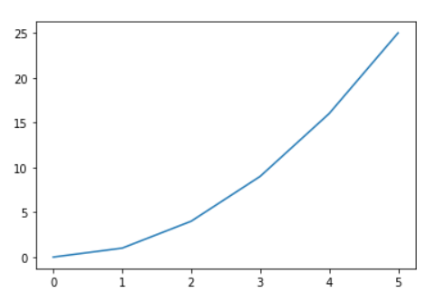
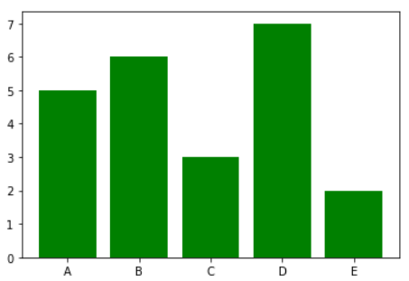
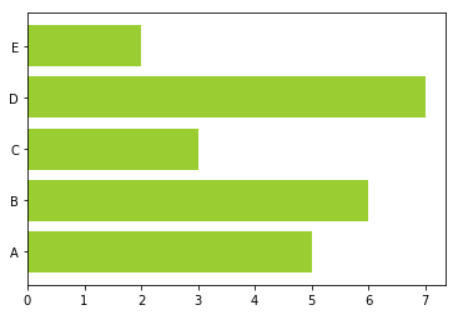
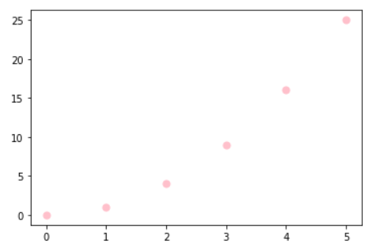
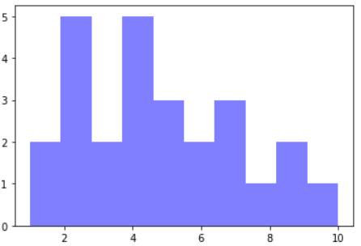

# 2. Matplotlib

Matplotlib is one of the most powerful tools for ***data visualization*** in Python.

***Data visualization*** the practice of visualizing data in graphs, icons, presentations and more. It is most commonly used to translate complex data into digestible insights for a non-technical audience.

So basically it allows us to create figures and plots, and makes it very easy to produce static raster or vector files without the need for any GUIs.

**Import Syntax**
```py
import matplotlib.pyplot as plt
```

### **Functional Approach**
Using the basic Matplotlib command, we can easily create a plot. Let’s plot an example using two arrays x and y :

```py
#create data for plotting
x = [0,1,2,3,4,5]
y = [0,1,4,9,16,25]
#the default graph style for plot is a line
plt.plot(x, y)
#display the graph
plt.show
```
Output : 



Now that we have a plot, let’s go on to name the x-axis, y-axis, and add a title using .xlabel(), .ylabel() and .title() using:

```py
plt.title('First Plot')
plt.xlable('x-axis')
plt.ylable('y-axis')
```

### **Bar Graphs**

When using a bar graph, the change in code will be from plt.plot() to plot.bar() changes it into a bar chart.

```py
#create data for plotting
x = [5,6,3,7,2]
y = ["A", "B", "C", "D", "E"]
plt.bar(y,x, color = "green")
plt.show()
```
Output :



Graph can also be flipped horizontally by adding an "h" after bar.
```py
#create data for plotting
x = [5,6,3,7,2]
y = ["A", "B", "C", "D", "E"]
plt.barh(y,x, color = "yellowgreen")
plt.show()
```
Output :




### **Scatter Plot**
A scatter plot is a diagram where each value in the data set is represented by a dot.

```py
#create data for plotting
x_values = [0,1,2,3,4,5]
squares = [0,1,4,9,16,25]
plt.scatter(x_values,squares, s=10, color = "pink")
plt.show()
```
Output:



### **Histograms**

A histogram is basically used to represent data provided in a form of some groups.It is accurate method for the graphical representation of numerical data distribution.It is a type of bar plot where X-axis represents the bin ranges while Y-axis gives information about frequency.

***Bin*** is an argument specific to a histogram and allows the user to customize how many bins they want.

```py
x = [2,1,6,4,2,4,8,9,4,2,4,10,6,4,5,7,7,3,2,7,5,3,5,9,2,1]
#plot for a histogram
plt.hist(x, bins = 10, color='blue', alpha=0.5)
plt.show()
```
Output :



## References
- [More on](http://index-of.co.uk/Tutorials/Matplotlib%20for%20Python%20Developers.pdf)