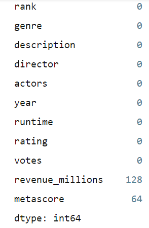

# 3. Pandas

The pandas package is the most important tool at the disposal of Data Scientists and Analysts working in Python today. 

This tool is essentially your data’s home. Through pandas, you get acquainted with your data by cleaning, transforming, and analyzing it. 
It can : 
* Clean the data by doing things like removing missing values and filtering rows or columns by some criteria.
* Visualize the data with help from Matplotlib. Plot bars, lines, histograms, bubbles, and more.
* Store the cleaned, transformed data back into a CSV, other file or database

Pandas is built on top of the NumPy package, meaning a lot of the structure of NumPy is used or replicated in Pandas. Data in pandas is often used to feed statistical analysis in SciPy, plotting functions from Matplotlib, and machine learning algorithms in Scikit-learn.

**Import Syntax**
```py
import pandas as pd
```

### **Reading data from CSVs**
With CSV files all you need is a single line to load in the data:
```py
df = pd.read_csv("../input/Iris.csv")
```
### **Reading data from JSON**
If you have a JSON file — which is essentially a stored Python dict — pandas can read this just as easily:

```py
df = pd.read_json('purchases.json')
```
### **Creating DataFrames from scratch**
Creating DataFrames right in Python is good to know and quite useful when testing new methods and functions you find in the pandas docs.

There are many ways to create a DataFrame from scratch, but a great option is to just use a simple dict.

```py
data = {
    'apples': [3, 2, 0, 1], 
    'oranges': [0, 3, 7, 2]
}

#pass it to the pandas DataFrame constructor:
purchases = pd.DataFrame(data)

purchases
```
Output :


## **Most important DataFrame operations**

### **Viewing your data**

* .head() outputs the first five rows of your DataFrame by default, but we could also pass a number as well: movies_df.head(10) would output the top ten rows

* .tail() outputs the last five rows of your DataFrame by default, but we could also pass a number as well: movies_df.tail(10) would output the last ten rows

```py
movies_df.head(10)

movies_df.tail(2)
```

### **Getting shape of the data set**

* .shape, which outputs just a tuple of (rows, columns):
```py
movies_df.shape
```
Output : 
```
(1000, 11)
```

### **Dealing with the null values**
When exploring data, you’ll most likely encounter missing or null values, which are essentially placeholders for non-existent values. Most commonly you'll see Python's *None*.

There are two options in dealing with nulls:

* Get rid of rows or columns with nulls
* Replace nulls with non-null values, a technique known as imputation

To count the number of nulls in each column we use an aggregate function for summing:
```py
movies_df.isnull().sum()
```
Output:



#### **Removing null values**
Removing null data is only suggested if you have a small amount of missing data.Remove nulls is pretty simple:
* This operation will delete any row with at least a single null value, but it will return a new DataFrame without altering the original one.
```py
movies_df.dropna()
```
* Other than just dropping rows, you can also drop columns with null values by setting axis=1:
```py
movies_df.dropna(axis=1)
```
#### **Imputation**
Imputation is a conventional feature engineering technique used to keep valuable data that have null values.

There may be instances where dropping every row with a null value removes too big a chunk from your dataset, so instead we can impute that null with another value, usually the mean, the median or the mode of that column.

For instance : Here we take a column of a dataset and replace all the null values with mean of the column:

```py
col1 = movies_df['income']
#Computing mean using .mean() function
col1_mean = col1.mean()
#Filling null values with mean of the column 
col1.fillna(col1_mean, inplace=True)
```
### **Knowing your variables**

* .describe() can also be used on a categorical variable to get the count of rows, unique count of categories, top category, and freq of top category:
```py
movies_df['genre'].describe()
```
Output : 


* Calculating correlation between variables : By using the correlation method .corr() we can generate the relationship between each continuous variable:

[Correlation](https://www.statisticshowto.com/probability-and-statistics/correlation-coefficient-formula/) tables are a numerical representation of the bivariate relationships in the dataset.

```py
movies_df.corr()
```
### **DataFrame slicing, selecting, extracting**
#### 1- **By column**
To extract a column as a DataFrame, you need to pass a list of column names. In our case that's just a single column:
```py
subset = movies_df[['genre', 'rating']]

print(subset.head(2))
```
#### 2- **By row**
For rows, we have two options:
* .loc - *loc*ates by name
* .iloc- *loc*ates by numerical index
```py
subset_1 = movies_df.loc['Prometheus':'Sing']
subset_2 = movies_df.iloc[1:4]
```
## References
- [More on](https://www.tutorialspoint.com/python_pandas/index.htm)