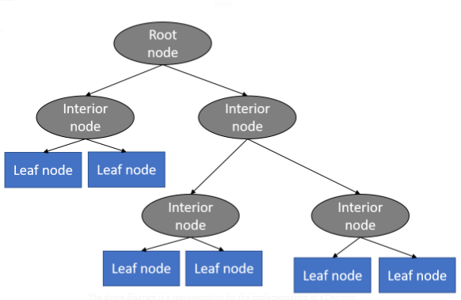

# Decision Tree Regression

Decision Trees can be summarized with the below bullet points:

* Decision trees are predictive models that use a set of binary rules to calculate a target value.
* Each individual tree is a fairly simple model that has branches, nodes and leaves.

##  Important Terminology 

* **Root Node**: It represents entire population or sample and this further gets divided into two or more homogeneous sets.
* **Splitting**: It is a process of dividing a node into two or more sub-nodes.
* **Decision Node**: When a sub-node splits into further sub-nodes, then it is called decision node.
* **Leaf/Terminal Node**: Nodes do not split is called Leaf or Terminal node.
* **Pruning**: When we remove sub-nodes of a decision node, this process is called pruning. You can say opposite process of splitting.
* **Branch / Sub-Tree**: A sub section of entire tree is called branch or sub-tree.
* **Parent and Child Node**: A node, which is divided into sub-nodes is called parent node of sub-nodes whereas sub-nodes are the child of parent node.


## Working

With a particular data point, it is run completely through the entirely tree by answering True/False questions till it reaches the leaf node. The final prediction is the average of the value of the dependent variable in that particular leaf node. Through multiple iterations, the Tree is able to predict a proper value for the data point.

 Decision trees have an advantage that it is easy to understand, lesser data cleaning is required, non-linearity does not affect the model’s performance and the number of hyper-parameters to be tuned is almost null. However, it may have an *over-fitting* problem, which can be resolved using the *Random Forest algorithm* which will be explained in the next article.

## Implementing Decision Tree Regression in Python

It’s time to start implementing Decision Tree Regression in Python. Like always, all you should do is apply the proper packages and their functions and classes.

**Data Modelling, Integration and Visualisation steps are skipped here. Sticking to the implementation of the model*

### **Step 1: Import packages and classes**

The first step will always consist of importing the libraries that are needed to develop the ML model. The NumPy, matplotlib and the Pandas libraries are imported.
```py
import numpy as np
import matplotlib.pyplot as plt
import pandas as pd
```
### **Step 2: Provide data**

The second step is defining data to work with. Following data set is obtained kaggle [Medical Cost Personal Datasets](https://www.kaggle.com/mirichoi0218/insurance?select=insurance.csv) data set.

```py
df = pd.read_csv('/content/datasets_13720_18513_insurance.csv')
#Conversion of categorical data to one-hot encoded data
df_1= pd.get_dummies(df, columns = ['sex','region','smoker'])
x=df_1.drop('charges', axis=1)
y=df_1['charges']
```

### **Step 3: Splitting of data in train and test data sets**
Separating data into training and testing sets is an important part of evaluating data mining models.By using similar data for training and testing, you can minimize the effects of data discrepancies and better understand the characteristics of the model.
```py
from sklearn.model_selection import train_test_split
x_train,x_test,y_train,y_test=train_test_split(x,y,test_size=0.25, random_state=1)
```

### **Step 4: Impoprting and creating a model and fit it**
The next step is to create a decision tree regression model and fit it using the existing data.

```py
from sklearn.tree import DecisionTreeRegressor
dr= DecisionTreeRegressor()
#Fitting model to model
dr.fit(x_train,y_train)
```
### **Step 5: Cross Validation**
**Before anything, what is cross-validation?**
 We usually use the entire dataset for building the final model, but we use cross-validation (CV) to get a better estimate of the generalization error on new unseen data. Simply, cross Validation allows you to alternate between training and testing datasets when your dataset is relatively small to maximize your error estimation.
```py
from sklearn.model_selection import cross_val_score
import numpy as np
score = round(np.mean(cross_val_score(dr, x_train, y_train, cv=5)),3) 
```

### **Step 6: Prediction**

Once you have your model fitted, you can get the predict the x_test(training data set) to check whether the model works satisfactorily and interpret it.
```py
#Prediction using .predict() function
y_pred=dr.predict(x_test)
```

### **Step 7: Testing accuracy**

Once you have got the prediction data, you can check its accuracy using the following commands :
```py 
from sklearn.metrics import accuracy_score, r2_score
r2_score(y_pred,y_test )
```
Output : 
```
0.712469896244416
```

## **Hyperparameter Tuning**
[Hyperparameter](https://www.dezyre.com/recipes/optimize-hyper-parameters-of-decisiontree-model-using-grid-search-in-python) tuning tuning is searching the hyperparameter space for a set of values that will optimize your model architecture.This is different from tuning your model parameters where you search your feature space that will best minimize a cost function.

Hyperparameter tuning is also tricky in the sense that there is no direct way to calculate how a change in the hyperparameter value will reduce the loss of your model, so we usually resort to experimentation. This starts with us specifying a range of possible values for all the hyperparameters. Now, this is where most get stuck, what values am I going to try, and to answer that question, you first need to understand what these hyperparameters mean and how changing a hyperparameter will affect your model architecture, thereby try to understand how your model performance might change.

The next step after you define the range of values is to use a hyperparameter tuning method, there’s a bunch, the most common and expensive being Grid Search where others like Random Search CV.

Here are two most important parameter : 

### **1- max_depth: int or None, optional (default=None)**
The maximum depth of the tree. If None, then nodes are expanded until all leaves are pure or until all leaves contain less than min_samples_split samples.

Let’s first talk about the default None case, if you don’t specify a depth for the tree, scikit-learn will expand the nodes until all leaves are pure, meaning the leaf will only have labels if you choose default for the min_samples_leaf, where the default value is one. Note that most of these hyperparameters are tied to one another and we will talk about the min_samples_leaf shortly. On the other hand, if you specify a min_samples_split, which we will look at next, the nodes will be expanded until all leaves contain less than the minimum number of samples. Scikit-learn will pick one over the other depending on which gives the maximum depth for your tree. There’s a lot of moving parts here, min_samples_split and min_samples_leaf so let’s just take the max_depth in isolation and see what happens to your model when you change it, so after we go through min_samples_split and min_samples_leaf we can get a better intuition of how all these come together.
In general, the deeper you allow your tree to grow, the more complex your model will become because you will have more splits and it captures more information about the data and this is one of the root causes of overfitting in decision trees because your model will fit perfectly for the training data and will not be able to generalize well on test set. So, if your model is overfitting, reducing the number for max_depth is one way to combat overfitting.

It is also bad to have a very low depth because your model will underfit sohow to find the best value, experiment because overfitting and underfitting are very subjective to a dataset, there is no one value fits all solution. So what I usually do is, let the model decide the max_depth first and then by comparing my train and test scores I look for overfitting or underfitting and depending on the degree I decrease or increase the max_depth.

### **2- min_samples_split: int, float, optional (default=2)**

The minimum number of samples required to split an internal node:
* If int, then consider min_samples_split as the minimum number.
* If float, then min_samples_split is a fraction and ceil(min_samples_split * n_samples) are the minimum number of samples for each split.

min_samples_split and min_samples_leaf, if you read their definitions it sounds like one would imply the other, but what you need to note is a leaf is an external node and the min_samples_split talks about an internal node and by definition an internal node can have further split whereas a leaf node by definition is a node without any children.
Say you specify a min_samples_split and the resulting split results in a leaf with 1 sample and you have specified min_samples_leaf as 2, then your min_samples_split will not be allowed. In other words, min_samples_leaf is always guaranteed no matter the min_samples_split value.

Now, let's tune our tree to increase its accuracy :
```py
params = {
    'max_depth' : [5,8,10,13,15],
    'min_samples_split' : [2,5,8,10,15],
}
```
Grid-search is used to find the optimal hyperparameters of a model which results in the most ‘accurate’ predictions. GridSearchCV is provided by sklearn for the same.
```py
from sklearn.model_selection import GridSearchCV
grid = GridSearchCV(dr,  params, cv = 5)
grid.fit(x_train,y_train)

#Predicting the result
y_pred2 = grid.predict(x_test)

#Obtaining the new accuracy score
r2_score(y_test,y_pred2)
```
To get the best parameters we use:
```py
grid.best_params_
```
